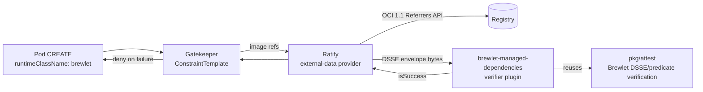

# Brewlet admission enforcement (Ratify + Gatekeeper)

Optional admission policy that **enforces Brewlet managed-dependency
signatures and identities** before a workload runs. It admits a pod on the
Brewlet runtime only when the Pod image resolves to a digest with a valid,
trusted final-image managed-dependency attestation.

> **Preview: live candidate validation, not production certification.** Two
> consecutive fresh local arm64 clusters passed the real registry, external
> verifier, Ratify/Gatekeeper and Kubernetes admission matrix, including serving
> JavaApplication-generated Pods. These runs use the released 0.5.0 verifier and
> publisher, a fixed-shim candidate and the corrected Verifier manifest, not
> unmodified 0.5.0. See [#95](https://github.com/microsoft/brewlet/issues/95) and
> the [live runbook](../docs/live-validation.md) for evidence and fixture-only
> cache, registry and TLS configuration. Evaluate only in a disposable cluster.

It provides the cluster-side enforcement that the managed-dependency-bundles
design (specification §4.5) leaves to admission policy: requiring a valid,
trusted managed-dependency attestation for pods that run on the Brewlet runtime.

## What it enforces

For every pod with `spec.runtimeClassName: brewlet`, each container image must
have a Brewlet **managed-dependency attestation** that:

- is an OCI 1.1 referrer with artifactType
  `application/vnd.brewlet.attestation.v1+json` carrying one
  `application/vnd.dsse.envelope.v1+json` layer;
- is a DSSE/in-toto Statement v1 with predicate type
  `https://brewlet.sh/attestations/managed-dependencies/v1`;
- is signed **ECDSA P-256** (ASN.1 DER over the DSSE PAE), with a `keyid` equal
  to `sha256(SPKI DER)`, verified against the operator-configured trusted public
  key;
- binds `finalImageDigest` to the admitted image's resolved digest, has
  `thinJar: true`, and carries well-formed digests for the application JAR,
  dependency bundle, dependency layer, lock, and SBOM; and
- names the expected application-builder identity **verbatim**.

Each candidate missing these claims, malformed, signed by the wrong key, naming
the wrong identity, or bound to a different subject is rejected. The image is
**denied (fail closed)** unless at least one candidate satisfies the **complete**
contract; claims are never combined across candidates. The node shim does not
add a second signature-verification pass; it executes the same image digest
admitted here.

## How it works



Ratify's `oras` referrer store performs registry discovery, authentication, and
blob fetch. The **Brewlet verifier plugin** (`admission/ratify-verifier`) runs
Brewlet's *exact* verification code — `github.com/microsoft/brewlet/pkg/attest`,
the single source of truth also used by the `brewlet` CLI and Maven plugin — over
the fetched DSSE envelope. There is no divergent crypto and no republishing of
the artifact into another signature format.

### Why not Kyverno / cosign policy-controller directly

Brewlet publishes a **custom** attestation artifact (its own artifactType and
in-toto predicate types) signed with a bare-key DSSE profile. Kyverno's image
verification and Sigstore's policy-controller consume **cosign**/**notation**
signature formats; they cannot consume Brewlet's artifact without first
republishing it in a cosign/notation layout. Ratify's external verifier plugin
model lets us verify the native Brewlet artifact **in place**, which is why this
integration targets Ratify.

## Pinned Ratify version and protocol

- Target: **Ratify v1.4.5** (CNCF sandbox; repo `github.com/notaryproject/ratify`,
  Go module path `github.com/ratify-project/ratify`). v2 is pre-release and is
  **not** targeted.
- The plugin implements the v1 **external verifier plugin protocol**: Ratify
  invokes the binary as a subprocess, sets `RATIFY_VERIFIER_COMMAND=VERIFY`,
  `RATIFY_VERIFIER_SUBJECT`, `RATIFY_VERIFIER_VERSION`, passes a
  `PluginInputConfig` JSON on stdin, and reads a `VerifierResult` JSON from
  stdout. The plugin uses the official `pkg/verifier/plugin/skel` entrypoint,
  and blank-imports `pkg/referrerstore/oras` so the skel can reconstruct the
  referrer store in-process to fetch the DSSE envelope.

## Build and publish the plugin

```bash
cd admission/ratify-verifier
go build -o brewlet-managed-dependencies .
```

Deliver the binary to Ratify one of two ways:

1. **Dynamic plugin** (shown in `deploy/20-ratify-verifier.yaml`): publish it as
   an OCI artifact and set `spec.source.artifact`; Ratify downloads it at
   startup.
2. **Baked image**: place the binary at
   `/home/nonroot/.ratify/plugins/brewlet-managed-dependencies` in a custom
   Ratify image, set `RATIFY_CONFIG=/home/nonroot/.ratify` so Ratify discovers
   that plugin directory, and drop `spec.source`. Pin the resulting image by
   digest from its first deployment. This is the delivery route exercised by
   the live scenario.

The plugin binary links Ratify's oras store, and therefore its full dependency
tree (oras-go plus cloud registry auth SDKs). Build it with the same toolchain
you use for Ratify itself.

## Deploy

Prerequisites: Ratify v1.4.x installed as a Gatekeeper external-data provider
(`ratify-provider`), Gatekeeper installed, and a registry that exposes the
OCI 1.1 Referrers API.

The pinned Ratify v1.4.5 chart CRD selects the plugin through `spec.name`;
it rejects `Verifier.spec.type`, even though the SDK exposes a Type field.
The shipped manifest omits that unsupported field.

Enable Gatekeeper external data and configure its validation webhook with
`failurePolicy: Fail`. Its rules must cover Pod CREATE/UPDATE and the
`pods/ephemeralcontainers` UPDATE subresource. Provider timeouts must be shorter
than the webhook timeout; the live fixture uses 20 and 30 seconds respectively.
`enforcementAction: deny` does not itself make webhook transport errors fail
closed when the webhook has `failurePolicy: Ignore`.

```bash
# 1. Edit deploy/20-ratify-verifier.yaml: set trustedPublicKey and
#    expectedBuilderIdentity, and pin the plugin source by digest.
kubectl apply -f deploy/10-ratify-store.yaml
kubectl apply -f deploy/20-ratify-verifier.yaml
kubectl apply -f deploy/30-ratify-policy.yaml   # Rego policy; replaces the singleton ratify-policy
kubectl apply -f deploy/40-gatekeeper-constrainttemplate.yaml
kubectl apply -f deploy/50-gatekeeper-constraint.yaml
```

Start the Gatekeeper constraint with `enforcementAction: warn` or `dryrun`,
confirm results, then switch to `deny`.

For non-Kubernetes verification (CI), `deploy/config.json` drives
`ratify verify -s <image@sha256:...> -c deploy/config.json`. Ratify v1.4.5's CLI
supports the built-in `regoPolicy` provider with an inline `policy` and
`passthroughEnabled: false`. The config uses the same verifier-name-bound rule
as the cluster policy (`deploy/30`) — see "Verifier selection" below.

**CI must check the JSON decision, not just the process exit status.** Ratify
v1.4.5 can exit successfully after printing a denied result (with `isSuccess`
false or omitted). Do not use `--silent` for an enforcement check. For example,
with `jq` available:

```bash
set -o pipefail
ratify verify -s "$IMAGE_DIGEST_REF" -c deploy/config.json |
  jq -e '.isSuccess == true'
```

## Production requirements and limitations

Read these before relying on this in production. Several are hard requirements
that fail closed when unmet.

### Registry: OCI 1.1 Referrers API is required
Ratify's oras store discovers referrers through the OCI 1.1 Referrers API (via
oras-go). Brewlet's own **deterministic per-referrer fallback tag scheme**
(spec §4.5:
`sha256-<subject>.<12 hex of sha256(artifactType)>.<24 hex of referrer digest>`)
is *not* the oras-go fallback tag scheme. On a registry that does **not**
implement the Referrers API, Ratify will not discover Brewlet attestations and
admission fails closed (deny). Use a Referrers-API-capable registry for images
that must be admitted.

### Private images: registry authentication
For private images, configure the oras store's `authProvider` (e.g. `k8Secrets`
with a docker-config Secret, or a cloud identity provider). Without credentials,
referrer discovery/blob fetch fails and admission denies.

### Key distribution and rotation are out of band
The trust anchor is a bare ECDSA P-256 public key (`trustedPublicKey` inline, or
`trustedPublicKeyPath` mounted). There is no Fulcio/keyless issuance and no Rekor
transparency log in this Brewlet contract. You must distribute and rotate the
public key yourself. During rotation, publish attestations under both the old and
new keys (Brewlet's per-referrer tags preserve multiple signatures) and configure
the verifier with the currently trusted key. Both shipped CLI and cluster Rego
policies are rotation-tolerant: they admit when **at least one** Brewlet
attestation verifies (matching spec §4.5's "at least one candidate" rule), so a
still-present old-key attestation neither blocks nor grants admission. (Do
**not** use Ratify's `config-policy` with `all` for this — it would deny as soon
as any old-key attestation fails; see the verifier-selection note below.)

### Verifier selection: use the Rego policy, ban overlapping verifiers
`deploy/config.json` and `deploy/30-ratify-policy.yaml` use **Rego** policies that
admit a subject only when the verifier named `brewlet-managed-dependencies`
reported success for the Brewlet attestation artifact type. This is deliberate
and security-relevant:
Ratify's alternative `config-policy` aggregates reports by artifact type, not
verifier name, and its executor runs only the **first** verifier whose
`CanVerify` matches a referrer and then stops (cluster ordering can be
nondeterministic). If the cluster also has a wildcard/overlapping verifier, it
could "verify" a Brewlet referrer **without running this plugin** — a bypass. The Rego policy runs every
matching verifier and binds success to *this* verifier by name, closing that
gap in both CLI and cluster configurations. The CLI no longer depends on a
single-verifier-only restriction for policy identity binding. The shipped
config still registers only the Brewlet verifier; do not add a wildcard
(`artifactTypes: "*"`) or overlapping verifier that also claims
`application/vnd.brewlet.attestation.v1+json`. Success from another verifier or
another artifact type cannot substitute for Brewlet verification. A separately
named verifier cannot block a valid Brewlet candidate merely by reporting
failure.

### Plugin delivery integrity
Ratify executes the external verifier binary it loads (via `source.artifact` or a
baked-in image) **without verifying it**. Pin `source.artifact` by immutable
digest, or bake the binary into a digest-pinned Ratify image. A mutable plugin
tag lets anyone who can push replace the verifier with an always-allow binary and
defeat the entire control.

### The cluster Ratify policy is a singleton
Ratify allows exactly one cluster `Policy` named `ratify-policy`. Applying
`deploy/30` **replaces** any existing cluster policy. In a shared Ratify install,
merge the Brewlet rule into your existing Rego policy rather than overwriting it.

### Identity is a free-form string trusted only through the key
`expectedBuilderIdentity` is compared verbatim against the `builderIdentity` in
the signed predicate. It is **not** a cryptographically-issued identity; it is
trustworthy only because the surrounding predicate is signed by the trusted key.
Anyone holding the trusted private key can assert any identity string. Treat the
key as the real trust boundary and scope identities per key accordingly.

### Image-level vs bundle-level signer enforcement
This integration enforces the **final-image** managed-dependency attestation. Its
predicate binds the dependency-bundle **digest**, source BOM, and the
**application-builder** identity — but it does **not** expose the bundle
**publisher's** signer identity. Therefore this admission path cannot directly
assert *"the bundle was signed by platform-team X."* It asserts that a trusted
application builder produced a thin-JAR image from a specific bundle digest.
Bundle-publisher trust is verified upstream, at Brewlet application publication
time (`brewlet:push` with `trustedPublicKey`/`trustedSignerIdentity`), which
refuses to compose an image from a bundle whose provenance does not match. Do not
represent this admission control as bundle-signer admission enforcement.

### Fail-closed on missing attestation
An image with no Brewlet attestation referrer is denied. The plugin itself is
only invoked once a matching referrer exists, so missing-evidence denial is
enforced by the policy layer: the Rego policy's `valid` rule requires a
successful `brewlet-managed-dependencies` report to exist, so a subject with zero
(or only non-Brewlet) referrers yields `valid == false`. Verified against Ratify
v1.4.5: a subject with no verifier reports fails closed. Still run the smoke test
on your Ratify version.

### Scope and required image pinning
The Gatekeeper template enforces on pods with `spec.runtimeClassName: brewlet`
(including raw workloads, not just `JavaApplication`-managed pods), and covers
regular, init, and ephemeral containers. Every such image must have an explicit
successful verification response; an empty, partial, or mismatched provider
response is denied rather than admitted.

Pods in the constraint's `excludedNamespaces` are **not** checked. Those
exclusions exist only to avoid a bootstrap deadlock when the provider is
unavailable while the control plane is starting, so treat them as a privileged
boundary:

- **Restrict pod creation in `kube-system`, `gatekeeper-system`, and
  `ratify-service` via RBAC.** Anyone who can create a pod in an excluded
  namespace can run an unattested Brewlet workload. Grant `create` on `pods`
  (and on controllers that create pods, such as `deployments` and `daemonsets`)
  in those namespaces only to cluster administrators.
- **Do not run Brewlet workloads in an excluded namespace.**
- The `brewlet` namespace is intentionally *not* excluded — no Brewlet component
  pod sets `runtimeClassName: brewlet`, so the template already ignores them.

**Images must be digest-pinned** (`repo@sha256:...`). Ratify passes the pod's
original image reference to the plugin; a tag is not resolved to a digest in that
hand-off, so the plugin cannot bind the attestation subject and **denies
tag-based images (fail closed)**. This matches Brewlet's model — the admission
webhook overwrites `brewlet.sh/artifact-digest` as a compatibility hint from the
selected Pod image, while the shim independently resolves the containerd target
through CRI's immutable image-config identity and cross-checks containerd's
protected `io.kubernetes.cri.image-name` annotation. The managed attestation
binds that image index digest. Enforce digest pinning at the source (CI/GitOps).

## Fail-closed behavior

The plugin returns `isSuccess: false` for every one of:

| Condition | Result |
|---|---|
| No trusted key / wrong signing key | deny |
| Wrong / missing `expectedBuilderIdentity` | deny |
| Subject digest mismatch (predicate binds a different image) | deny |
| Tampered DSSE payload or signature | deny |
| Wrong predicate type (e.g. a bundle predicate) | deny |
| `thinJar != true` or malformed predicate digests | deny |
| Manifest not exactly one DSSE layer | deny |
| Registry manifest/blob fetch error | deny |
| Non-digest / unresolved (tag-based) subject | deny |
| No Brewlet attestation referrer at all | deny (CLI and cluster Rego policies) |
| A different/wildcard verifier claims the artifact type | not admitted on its behalf (Rego binds this verifier by name) |

These are per-candidate failures. An image with an additional complete, valid
candidate is admitted; an image containing only rejected candidates is denied.

## Smoke test

```bash
# Should report isSuccess: true: an image with a valid managed-dependency attestation
#   signed by the trusted key/identity.
ratify verify -s registry.example.com/apps/orders@sha256:<digest> -c deploy/config.json

# Should report denial: the same image verified against a DIFFERENT trusted key,
#   or an image with no Brewlet attestation.
# CI must enforce the JSON decision as shown above.
```

In-cluster, apply the constraint in `deny` mode and confirm that a Brewlet pod
whose image lacks a valid attestation is rejected, while a properly attested one
is admitted.

## Tests

- `admission/ratify-verifier` unit/contract tests exercise the plugin's
  `VerifyReference`/`verifyManaged` against the **real** Ratify `ReferrerStore`
  interface with a fake store, covering the full fail-closed matrix above, plus
  config parsing.
- `core/pkg/attest` tests cover the shared DSSE/predicate verification directly.
- Policy component tests load both deployed policy configurations through
  Ratify v1.4.5's actual policy factory and executor. An in-memory referrer store
  and an in-process plugin transport exercise real DSSE verification without a
  registry or cluster. The matrix covers old/new signer rotation in either
  order, missing/all-invalid evidence, wrong key/builder/subject, tampered bundle
  claims, no cross-candidate trust merging, and unrelated/overlapping verifier
  success in either selection order. These are component tests, not
  subprocess, registry, or Kubernetes deployment tests.
- The independently runnable live scenario uses pinned Zot native referrers,
  Ratify v1.4.5, Gatekeeper v3.18.3 and the real external verifier. Its 47 required
  assertions cover trusted serving, all invalid-evidence classes, signer
  rotation with fresh candidate reports, competing verifiers, regular/init/
  ephemeral admission requests, exclusions, registry failures and provider
  outage. It never treats missing prerequisites as a skip.

Run:

```bash
( cd core && go test ./pkg/attest/... )
( cd admission/ratify-verifier && go test ./... )
```

For the live invocation, release/candidate distinction, diagnostics and remaining
limits, use the [disposable live-validation runbook](../docs/live-validation.md).
