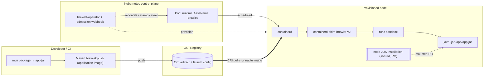

# Brewlet documentation

**Run Java applications on Kubernetes the way you run WebAssembly — ship just your
app (a fat JAR, a layered classpath, or a module), no Dockerfile, no base image.**

This directory is the complete, task-oriented documentation for Brewlet. If you
want the elevator pitch and the "why", start with the [project landing page](/);
if you want the deep architecture and design rationale, read the
[SPECIFICATION](https://github.com/microsoft/brewlet/blob/main/specs/SPECIFICATION.md). These pages sit in between: they tell you how
to actually **install, configure, deploy, tune, and operate** Brewlet.

Brewlet is developed in the
[`microsoft/brewlet`](https://github.com/microsoft/brewlet) monorepo. Runtime code
lives at its root, Kubernetes resources in
[`kubernetes/`](https://github.com/microsoft/brewlet/tree/main/kubernetes), Maven
goals in [`maven-plugin/`](https://github.com/microsoft/brewlet/tree/main/maven-plugin),
architecture contracts in
[`specs/`](https://github.com/microsoft/brewlet/tree/main/specs), and runnable
examples in
[`integration-tests/`](https://github.com/microsoft/brewlet/tree/main/integration-tests).

> ⚠️ Brewlet is not production-ready. These docs cover functionality available in
> the current release. Future work is kept separately in the
> [roadmap](https://github.com/microsoft/brewlet/blob/main/ROADMAP.md).

## Preview status and validation

Brewlet **0.x versions are preview releases, not stable releases**. Start with the
[local CLI example](getting-started.md) or the
[local Kubernetes guide](local-kubernetes.md), using a disposable evaluation
environment rather than a production or shared cluster.

Implemented functionality and live end-to-end validation are different:

| Area | Existing coverage | Remaining boundary |
|---|---|---|
| Public release access and local use | The Pages release smoke exercises the released CLI, local Java example, Maven plugin, anonymous chart download, component manifest access, and release provenance. | It renders but does not install the chart or provision nodes. |
| Kubernetes runtime | The source-built E2E tiers exercise provisioning, serving, manual scaling, and runtime telemetry. | These scenarios do not establish the admission or autoscaling loops below, or production readiness. |
| Managed-dependency admission | Component tests use substituted registry access and plugin transport; two fresh local arm64 clusters additionally passed 47 real registry, external verifier, Ratify/Gatekeeper and API assertions, including serving JavaApplication Pods. | Live candidate validation uses the released verifier/publisher, corrected Verifier manifest, fixed shim and fixture-only uncached settings. It does not establish an unmodified release pass or ordinary ephemeral-debug execution support; see [#95](https://github.com/microsoft/brewlet/issues/95) and the [runbook](live-validation.md). |
| CPU autoscaling | Alongside HPA creation and simulated HPA ownership tests, two fresh local arm64 clusters passed real metrics-server-driven 1-to-3-to-1 scaling, Ready Pods, serving endpoints and three ownership reconciliations with a fixed-shim candidate. | The unmodified baseline release exposed a packed-layer GC scale-out failure. The candidate fixes warm reuse, not cold startup after missing-source GC; see [#94](https://github.com/microsoft/brewlet/issues/94) and the [runbook](live-validation.md). |

[The validation tracker (#93)](https://github.com/microsoft/brewlet/issues/93)
requires both live scenarios to succeed on two consecutive fresh disposable
clusters, with mandatory assertions, failure diagnostics, and bounded cleanup.
The existing E2E harness permits skips; a successful run alone is not evidence
that every assertion executed. Broader strict-mode work is tracked in
[#13](https://github.com/microsoft/brewlet/issues/13).

Admission exposed an unsupported Verifier manifest field; CPU validation exposed
a packed-layer GC defect. Both passes use explicitly identified candidate
corrections rather than an unmodified baseline installation.
Both corrections shipped in a subsequent release, but the historical live
evidence remains pinned to the tested baseline plus those candidate corrections,
rather than being relabeled as an unmodified release run.
Do not treat component tests or release smoke results as proof of either live loop,
or these disposable-cluster runs as production certification.

The [disposable live-validation runbook](live-validation.md) describes the
independent required scenarios, pinned release baseline, evidence and limits.

---

## Where to start

| If you are a… | Start here |
|---|---|
| **Developer** shipping a Java service | [Building & publishing application artifacts](building-and-publishing.md) → [Deploying workloads](deploying-workloads.md) |
| **Platform / cluster operator** enabling Brewlet on a cluster | [Installation](installation.md) → [Configuration](configuration.md) → [JDK management](jdk-management.md) |
| **Anyone** who wants to try the released CLI locally | [Getting started](getting-started.md) |
| **Anyone** who wants to run an app on local Kubernetes | [Local Kubernetes](local-kubernetes.md) |
| **Someone evaluating** the idea | [Concepts & architecture](concepts.md) |
| **Someone tracking planned work** | [Roadmap](https://github.com/microsoft/brewlet/blob/main/ROADMAP.md) |

---

## Table of contents

### Understand it
- **[Concepts & architecture](concepts.md)** — the model, the SpinKube comparison, the
  component inventory, and the end-to-end build/run flow.

### Try it
- **[Getting started](getting-started.md)** — download the released CLI, build
  the demo JAR, package and inspect it as an OCI artifact, run it with a
  local JDK, and preview the shim's runtime bundle. No Kubernetes required.
- **[Local Kubernetes](local-kubernetes.md)** — set up Docker Desktop with
  Kubernetes kind, install Brewlet on a worker, and run Spring PetClinic in
  your browser. One complete guide, with no registry account required.

### Run it on a cluster
- **[Installation](installation.md)** — prerequisites, the SpinKube-style `helm
  install`, the manual (no-Helm) path, and how to verify the fleet is ready.
- **[Configuration](configuration.md)** — every knob: Helm values, provisioner
  env vars, operator/admission flags, the RuntimeClass, and precedence rules.
- **[JDK management](jdk-management.md)** — installing, versioning, patching, and
  multi-arch JDK runtime roots on nodes (copy-from-image).
- **[Launchers](launchers.md)** — vanilla `java` vs. `jaz`, installing launcher
  layers, choosing one, and how launcher selection is resolved.

### Ship workloads
- **[Building & publishing application artifacts](building-and-publishing.md)** — build a
  fat JAR (or a layered classpath app), author the launch config, and push it with the `brewlet` CLI or ORAS.
- **[Deploying workloads](deploying-workloads.md)** — the raw `Deployment` path,
  the `JavaApplication` CRD, and requesting a specific JDK/launcher via annotations.
- **[Resource requests, limits & JVM tuning](resource-tuning.md)** — how requests
  affect scheduling/HPA, limits become cgroup constraints, and the container-aware
  JVM (and `jaz`) react.

### Operate it
- **[Security](security.md)** — isolation model, non-root defaults, artifact
  integrity, and the sharp edge of privileged node provisioning.
- **[Observability & day‑2](observability.md)** — networking, logs, metrics,
  probes, JDK upgrades, and multi-arch operations.
- **[Runtime metrics and Grafana dashboards](runtime-metrics.md)** — enable and
  scrape Brewlet's control-plane and runtime telemetry, use the bundled
  dashboard, and troubleshoot missing targets or inventory.
- **[Multi-architecture fleets](multi-arch.md)** — run portable JARs across
  `amd64` and `arm64`, and constrain workloads that bundle native libraries.
- **[Troubleshooting](troubleshooting.md)** — failure modes, what they look like,
  and how to fix them.

### Reference
- **[CLI reference](cli-reference.md)** — `brewlet push / inspect / run / bundle / jdks`.
- **[Reference](reference.md)** — labels & annotations, OCI media types, the
  artifact & launch-config schema, well-known paths, and a glossary.
- **[JPMS support](jpms-support.md)** — how Brewlet runs modular
  (JPMS) apps on the module path rather than only fat JARs; `entry.mode: module` and the
  optional module/classpath layer.
- **[Layered classpath deployment](layered-classpath-deployment.md)** —
  splitting an app into stable dependency layers + a thin app layer for registry
  dedup and faster pulls; the `classpath.layer.v1+tar` layer and `entry.classPath`.
- **[Runnable-image delivery](runnable-image.md)** — `brewlet push --format=image`
  publishes the JAR as a standard, kubelet-pullable OCI image so a
  `runtimeClassName: brewlet` pod can set a digest-pinned
  `image: <repo@sha256:…>` and let kubelet pull + unpack it (the WASI/SpinKube
  pull path), instead of custom media types that `ImagePullBackOff`.

### Planned work

- **[Roadmap](https://github.com/microsoft/brewlet/blob/main/ROADMAP.md)** — proposed capabilities and known follow-up work.
  Roadmap items are not part of the shipped feature set.

---

## How the pieces fit together (one diagram)

See [Concepts & architecture](concepts.md) for the full walkthrough.
