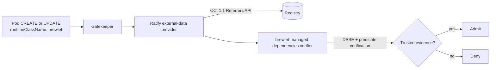

# Admission enforcement

Brewlet's production admission integration admits a pod using
`runtimeClassName: brewlet` only when the Pod image resolves to a digest with a
valid, trusted final-image managed-dependency attestation. It combines a
**Ratify v1.4.5 external verifier plugin** with a **Gatekeeper policy** and
verifies Brewlet's native OCI 1.1 referrer in place so the runtime executes that
same admitted image.

The plugin verifies Brewlet's native evidence directly, reusing Brewlet's own
DSSE and predicate verification code instead of requiring evidence to be
republished in cosign or notation format.

The [Brewlet specification section 4.5](https://github.com/microsoft/brewlet/blob/main/specs/SPECIFICATION.md#45-managed-dependency-bundles)
defines the normative attestation contract. The
[`admission/` source directory](https://github.com/microsoft/brewlet/tree/main/admission)
contains the verifier, deployable resources, and authoritative operational
notes.



---

Ratify/Gatekeeper perform the signature and identity check before admission.
The node shim does not introduce a second on-node signature-verification pass;
it resolves and executes the same image digest admitted by the policy.

## Why Ratify

Brewlet publishes a custom attestation artifact with its own artifact type,
in-toto predicate types, and bare-key DSSE profile. Kyverno image verification
and Sigstore policy-controller consume cosign or notation formats; they cannot
consume Brewlet's native artifact directly without republishing it in one of
those formats.

Ratify's external verifier protocol can verify the native Brewlet referrer in
place. The integration targets Ratify **v1.4.5** and its v1 external verifier
plugin protocol.

---

## What is verified

The image attestation is:

1. an OCI 1.1 referrer with artifact type
   `application/vnd.brewlet.attestation.v1+json`;
2. a DSSE envelope containing an in-toto Statement v1 with predicate type
   `https://brewlet.sh/attestations/managed-dependencies/v1`;
3. signed with ECDSA P-256 over the DSSE pre-authentication encoding, with
   `keyid` equal to `sha256(SPKI DER)`; and
4. bound to the admitted final image digest, `thinJar: true`, the application
   JAR, bundle, dependency layer, lock, SBOM, source BOM, and expected
   application-builder identity.

Bundle provenance uses the separate predicate type
`https://brewlet.sh/attestations/dependency-bundle/v1`. Admission requires the
final-image statement; bundle-level provenance establishes trust earlier, while
the application image is composed.

Missing, malformed, wrong-key, wrong-identity, wrong-subject, or incorrectly
bound evidence is denied.

---

## Prerequisites

- Ratify v1.4.x installed as the `ratify-provider` Gatekeeper external-data
  provider.
- Gatekeeper installed.
- A registry that implements the **OCI 1.1 Referrers API**.
- A digest-pinned Brewlet application image with a signed final-image
  managed-dependency attestation.
- The application-builder's ECDSA P-256 public key and the exact expected
  builder identity.

!!! warning "Referrers API is mandatory"

    Brewlet's custom deterministic fallback tags are not Ratify/oras discovery
    metadata. If the registry does not expose the OCI 1.1 Referrers API, Ratify
    cannot discover the attestation and admission denies the workload.

For private registries, configure the oras store's `authProvider`, such as a
`k8Secrets` provider backed by a Docker-config Secret. Authentication or blob
fetch failures deny admission.

---

## Build and deliver the verifier plugin

Build the external verifier:

```bash
git clone https://github.com/microsoft/brewlet.git
cd brewlet/admission/ratify-verifier
go build -o brewlet-managed-dependencies .
```

Choose one delivery model:

=== "Dynamic plugin artifact"

    Publish the binary as an OCI artifact and configure
    [`20-ratify-verifier.yaml`](https://github.com/microsoft/brewlet/blob/main/admission/deploy/20-ratify-verifier.yaml)
    with an immutable source:

    ```yaml
    spec:
      source:
        artifact: registry.example.com/brewlet/ratify-verifier@sha256:<plugin-digest>
    ```

    Ratify executes the downloaded plugin without independently verifying it.
    A mutable tag would let someone replace the verifier with an always-allow
    binary, so the source must be digest-pinned.

=== "Baked Ratify image"

    Place the binary at:

    ```text
    /home/nonroot/.ratify/plugins/brewlet-managed-dependencies
    ```

    Use a digest-pinned custom Ratify image and remove `spec.source` from the
    Verifier resource.

The plugin links Ratify's oras store and its registry-auth dependencies. Build
it with a toolchain compatible with the Ratify installation.

---

## Configure and deploy

1. Edit
   [`20-ratify-verifier.yaml`](https://github.com/microsoft/brewlet/blob/main/admission/deploy/20-ratify-verifier.yaml):
   set the digest-pinned plugin source (or remove it for a baked plugin), provide
   `trustedPublicKey` or `trustedPublicKeyPath`, and set
   `expectedBuilderIdentity`.
2. Configure private-registry authentication in
   [`10-ratify-store.yaml`](https://github.com/microsoft/brewlet/blob/main/admission/deploy/10-ratify-store.yaml)
   when required.
3. Review the namespace exclusions and begin
   [`50-gatekeeper-constraint.yaml`](https://github.com/microsoft/brewlet/blob/main/admission/deploy/50-gatekeeper-constraint.yaml)
   with `enforcementAction: warn` or `dryrun`.
4. Apply the resources in order:

```bash
kubectl apply -f admission/deploy/10-ratify-store.yaml
kubectl apply -f admission/deploy/20-ratify-verifier.yaml
kubectl apply -f admission/deploy/30-ratify-policy.yaml
kubectl apply -f admission/deploy/40-gatekeeper-constrainttemplate.yaml
kubectl apply -f admission/deploy/50-gatekeeper-constraint.yaml
```

The resources configure:

| File | Resource | Purpose |
|---|---|---|
| [`10-ratify-store.yaml`](https://github.com/microsoft/brewlet/blob/main/admission/deploy/10-ratify-store.yaml) | Ratify Store | Discovers native referrers through the OCI 1.1 Referrers API and fetches their blobs. |
| [`20-ratify-verifier.yaml`](https://github.com/microsoft/brewlet/blob/main/admission/deploy/20-ratify-verifier.yaml) | Ratify Verifier | Loads the Brewlet plugin and configures its trusted key and expected application-builder identity. |
| [`30-ratify-policy.yaml`](https://github.com/microsoft/brewlet/blob/main/admission/deploy/30-ratify-policy.yaml) | Ratify Rego Policy | Counts success only from the named `brewlet-managed-dependencies` verifier and admits when at least one attestation verifies. |
| [`40-gatekeeper-constrainttemplate.yaml`](https://github.com/microsoft/brewlet/blob/main/admission/deploy/40-gatekeeper-constrainttemplate.yaml) | Gatekeeper ConstraintTemplate | Sends regular, init, and ephemeral container images from Brewlet-runtime pods to Ratify. |
| [`50-gatekeeper-constraint.yaml`](https://github.com/microsoft/brewlet/blob/main/admission/deploy/50-gatekeeper-constraint.yaml) | Gatekeeper Constraint | Applies the check to Pod CREATE and UPDATE requests, with explicit namespace exclusions. |

Observe warnings and test known-good and known-bad images before changing the
constraint to `enforcementAction: deny`.

!!! warning "Use the Rego policy in clusters"

    Ratify's `config-policy` can accept success from the first matching or an
    overlapping verifier without proving that the Brewlet plugin ran. The
    shipped Rego policy runs matching verifiers and binds success to the
    verifier named `brewlet-managed-dependencies`. Do not register a wildcard
    or overlapping verifier for Brewlet's attestation artifact type.

!!! warning "The cluster policy is a singleton"

    Ratify permits one cluster Policy named `ratify-policy`. Applying
    `30-ratify-policy.yaml` replaces an existing policy. In a shared Ratify
    installation, merge the Brewlet rule into the existing Rego policy instead.

---

## Verify in CI

The non-Kubernetes
[`config.json`](https://github.com/microsoft/brewlet/blob/main/admission/deploy/config.json)
registers only this verifier, so its `config-policy` use is safe for that
isolated CLI process:

```bash
ratify verify \
  -s registry.example.com/apps/orders@sha256:<digest> \
  -c admission/deploy/config.json
```

Install the plugin at
`~/.ratify/plugins/brewlet-managed-dependencies`, configure the trusted key path
and expected identity in `config.json`, and use a Referrers-API-capable
registry. Test with the trusted key and with a different key or unsigned image
to confirm the expected pass and fail paths.

---

## Production trust model and limitations

### Key distribution and rotation

The trust anchor is a bare ECDSA P-256 public key. Brewlet does not use
Fulcio/keyless issuance or a Rekor transparency log for this contract. Key
distribution and rotation are out of band.

The Rego policy is rotation-tolerant: at least one valid Brewlet attestation is
enough to admit an image. During rotation, publish attestations under the old
and new keys and move verifier trust deliberately. A remaining invalid old-key
attestation neither grants nor blocks admission when another candidate verifies.

### Identity is a signed free-form string

`expectedBuilderIdentity` is compared verbatim with the `builderIdentity` in the
signed predicate. It is not an OIDC- or Fulcio-issued identity. Anyone holding
the trusted private key can assert any string, so the key is the actual trust
boundary.

### Image-level and bundle-level trust

Admission verifies the **final-image** managed-dependency attestation. That
predicate binds the bundle digest and source BOM but does not expose the bundle
publisher's signer identity. The policy therefore cannot directly assert that a
specific platform team signed the bundle.

Bundle-publisher trust is enforced upstream during application publication:
`brewlet:push` verifies present bundle provenance with
`trustedPublicKey`/`trustedSignerIdentity` before composing the image. Admission
then trusts the application builder that signed the final image. See
[Managed dependency bundles](managed-dependency-bundles.md#signed-and-unsigned-combinations).

### Digest-pinned images are required

Images must use `repo@sha256:...`. Ratify passes the original image reference to
the plugin; a tag is not resolved to a digest in that hand-off, so the plugin
cannot bind the statement subject and denies tag-based images. Enforce digest
pinning in CI or GitOps.

### Scope and excluded namespaces

The Gatekeeper template covers every container, init container, and ephemeral
container on pods with `runtimeClassName: brewlet`, including raw workloads and
pods generated from `JavaApplication`. Non-Brewlet pods are not checked.

Namespaces excluded to prevent infrastructure bootstrap deadlocks are also
outside this control. Keep Brewlet workloads out of excluded namespaces and
restrict who can create pods there.

---

## Fail-closed behavior

The integration denies:

- missing Brewlet attestation referrers;
- missing trusted key or a signature from the wrong key;
- missing or mismatched expected builder identity;
- tampered DSSE payloads or signatures;
- a subject or `finalImageDigest` bound to another image;
- the bundle-provenance predicate where the final-image predicate is required;
- `thinJar` values other than `true` or malformed predicate digests;
- an attestation manifest that does not contain exactly one DSSE layer;
- registry discovery, authentication, manifest, or blob-fetch failures;
- tag-based or otherwise unresolved image subjects; and
- success reported only by another or overlapping verifier.

Enable the policy only after exercising these failure paths in your environment,
then keep the constraint in `deny` mode for production workloads.
