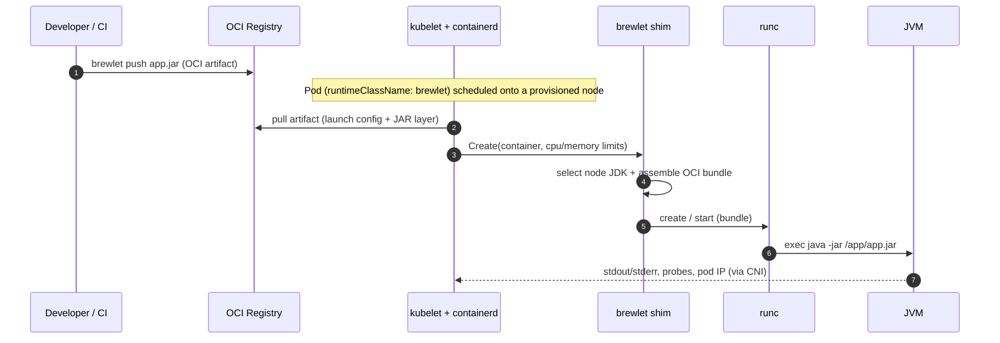

# Concepts & architecture

This page explains the Brewlet model, the components that implement it, and the
end-to-end flow from `mvn package` to a running JVM on a node. For the full design
rationale and every edge case, see the [SPECIFICATION](https://github.com/microsoft/brewlet/blob/main/specs/SPECIFICATION.md).

---

## The core idea

Java container images commonly combine application code with a JVM and an OS
userland. Tools such as Jib and Buildpacks can automate packaging without a
Dockerfile, and unchanged layers can be cached. Runtime versions and patches
still travel with those application images.

WebAssembly already solved this. With [SpinKube](https://www.spinkube.dev/), the
Wasm *runtime* lives on the node, the developer ships a Wasm/Spin application as
an OCI artifact, and a `RuntimeClass` routes it through a containerd shim. No
Dockerfile, no base image.

**Brewlet brings that exact model to the JVM.** You publish **your Java application** —
most often a single `app.jar`, but just as well a layered classpath app or a
JPMS module — as an OCI artifact. A node-resident JDK runs it (e.g. the canonical
`java -jar app.jar`), inside a runc sandbox whose CPU/memory limits come from the
Kubernetes deployment descriptor.

| You stop owning… | Because… |
|---|---|
| Dockerfiles | the plugin packages application-only OCI images |
| OS base layers & their CVEs | there is no OS layer in the artifact |
| A JVM copy in every image | the JDK installation lives on the node, shared and patched centrally |
| Bundling runtime layers with app releases | the payload contains application code, dependencies, and launch metadata; runtime installation is separate |
| Per-arch image builds & manifest lists | a JAR is JVM **bytecode — architecture-neutral**, so the *same* artifact runs on any provisioned arch (`amd64`/`arm64`); the node-side JDK is per-arch |

Updating a node JDK does not change an already-running JVM. Existing workloads
retain their runtime roots until they stop; roll or restart them to use the
updated runtime without rebuilding their application images. Each workload
still has its own JVM and heap. Shared runtime storage is not a guarantee of
lower memory use or faster startup; measure those outcomes for your workload.

> **Portable bytecode, platform-specific dependencies.** Pure Java bytecode can
> run on compatible `amd64`/`arm64` JDKs. JNI libraries and prebuilt AppCDS
> archives are platform-specific; account for them when publishing and selecting
> the deployment's `arch` constraint. See
> [multi-arch fleets & non-portable JARs](multi-arch.md).

---

## The SpinKube parallel

| Concern | SpinKube (Wasm) | Brewlet (JVM) |
|---|---|---|
| Primary workload | Spin-compatible Wasm applications | Existing JVM applications |
| Developer artifact | Wasm/Spin application in OCI | JAR, layered classpath, or JPMS app in OCI |
| Runtime location | Wasm runtime on the node | JDK/JVM distribution on the node |
| Node enablement | Runtime Class Manager installs and manages containerd shims | privileged provisioner DaemonSet installs shim + JDK |
| Execution routing | `RuntimeClass` → runwasi-based containerd shim | `RuntimeClass` → Brewlet containerd shim → runc |
| Workload API | `SpinApp` / `SpinAppExecutor` CRDs | Pod or `JavaApplication` CRD |
| Isolation | Wasm sandbox and capability model | Linux namespaces and cgroups through runc |
| Container build needed? | no | no |
| Main advantage | small footprint, fast startup, low idle resource use | JVM compatibility without bundling a runtime in every app |

[Runtime Class Manager](https://github.com/spinframework/runtime-class-manager),
SpinKube's shim lifecycle operator, corresponds primarily to Brewlet's
node-provisioning layer. SpinKube as a whole is the closer comparison to Brewlet.

Brewlet deliberately keeps **container-grade isolation** (runc) while adopting the
**Wasm-grade developer experience** (ship only the payload).

---

## Component inventory

Brewlet is a small set of cooperating components organized in focused monorepo
directories. Each implementation maps to a section of the
[specification](https://github.com/microsoft/brewlet/blob/main/specs/SPECIFICATION.md).

| Component | What it does | Where |
|---|---|---|
| **OCI application artifact** | A Java application — a fat JAR, or an app split into classpath layers — plus a small JSON launch config. Published by default as a kubelet-pullable **runnable image**; the native custom-media-type artifact form is used for local OCI-layout / CLI workflows. Neither carries an OS layer or a JVM. | [`core/internal/artifact/`](https://github.com/microsoft/brewlet/tree/main/core/internal/artifact/), spec §4 |
| **Managed dependency bundle** | An Ops-published, immutable approved classpath derived from a Maven BOM. Application publication verifies its dependency graph and composes the exact bundle layer with a thin JAR; Kubernetes never resolves Maven dependencies. | [Managed dependency bundles](managed-dependency-bundles.md), [spec §4.5](https://github.com/microsoft/brewlet/blob/main/specs/SPECIFICATION.md#45-managed-dependency-bundles) |
| **`brewlet` CLI** | Developer/ops tool: `push`, `inspect`, `run`, `bundle`, `jdks`. | [`core/cmd/brewlet/`](https://github.com/microsoft/brewlet/tree/main/core/cmd/brewlet/) |
| **`containerd-shim-brewlet-v2`** | containerd Runtime v2 shim. On `Create` it disassembles the workload image, selects a node JDK, assembles an overlay-rootfs `java -jar` sandbox, and delegates to runc. | [`core/shim/`](https://github.com/microsoft/brewlet/tree/main/core/shim/), spec §6 |
| **`brewlet-node-provisioner`** | Privileged DaemonSet. On opted-in nodes it installs the shim, materializes JDK roots + launcher layers, registers the containerd runtime, and labels the node ready. | Source: [`provisioner/`](https://github.com/microsoft/brewlet/tree/main/provisioner); deployment: [`kubernetes/deploy/node-provisioner.yaml`](https://github.com/microsoft/brewlet/blob/main/kubernetes/deploy/node-provisioner.yaml); spec §5 |
| **`brewlet-operator`** | Node lifecycle controller. Watches opted-in nodes, manages the provisioner DaemonSet + the `brewlet` RuntimeClass, and tracks node readiness. | [`kubernetes/cmd/manager/`](https://github.com/microsoft/brewlet/tree/main/kubernetes/cmd/manager), spec §8.1 |
| **`brewlet-admission`** | Mutating+validating webhook. Overwrites compatibility hints from the selected Pod image onto brewlet pods and matches/steers requested JDK/launcher onto compatible nodes. | [`kubernetes/cmd/admission/`](https://github.com/microsoft/brewlet/tree/main/kubernetes/cmd/admission), spec §8.3 |
| **Ratify/Gatekeeper enforcement** | Optional policy requiring a valid, trusted final-image managed-dependency attestation for every image on a Brewlet-runtime pod; [#95](https://github.com/microsoft/brewlet/issues/95) records live candidate validation with a corrected manifest and fixture-only settings, not production certification. | [Admission enforcement](admission-enforcement.md), [`admission/`](https://github.com/microsoft/brewlet/tree/main/admission) |
| **`RuntimeClass/brewlet`** | Routes pods to the shim handler; its `nodeSelector` keeps workloads on ready nodes. | [`deploy/runtimeclass.yaml`](https://github.com/microsoft/brewlet/blob/main/kubernetes/deploy/runtimeclass.yaml), spec §7 |
| **`JavaApplication` CRD** | The higher-level developer-facing deployment descriptor, reconciled by the operator's `JavaApplication` controller (§8.2). | [`deploy/javaapplication-crd.yaml`](https://github.com/microsoft/brewlet/blob/main/kubernetes/deploy/javaapplication-crd.yaml), spec §9 |
| **Helm chart** | SpinKube-style single-command activation of the operator + provisioner RBAC + webhook. | [`charts/brewlet/`](https://github.com/microsoft/brewlet/tree/main/kubernetes/charts/brewlet/) |

---

## High-level architecture

```
 Developer / CI                  Control Plane                 Worker Node (provisioned)
 ───────────────                 ─────────────                 ─────────────────────────
  mvn package                ┌──────────────────────┐
  Maven plugin ──► Registry  │  brewlet-operator     │  watches  ┌──────────────────────┐
                    │        │  + admission webhook  │ ────────► │  containerd + shim    │
                    │        └──────────┬───────────┘  annotate  │        │ runc         │
                    │                   │ generates              │        ▼              │
                    │           ┌───────────────────┐  scheduled │  ┌────────────────┐   │
                    │           │ Deployment / Pod  │ ─────────► │  │ Sandbox        │   │
                    │           │ runtimeClassName: │            │  │ (cgroup+netns) │   │
                    │           │   brewlet         │            │  │  java -jar     │   │
                    │           └───────────────────┘            │  │  /app/app.jar  │   │
                    └────────── CRI pulls pod image ────────────► │  │  (node JDK RO) │   │
                                                                 │  └────────────────┘   │
                                                                 └──────────────────────┘
```

---

## End-to-end flow

### Build time (developer / CI)

1. Build your fat JAR as usual — `mvn package` / `gradle bootJar`. Nothing
   Brewlet-specific.
2. Push it — by default as a kubelet-pullable **runnable OCI image** (or, with
   `--format artifact`, as a native artifact with custom media types) plus a tiny
   JSON *launch config* (main JAR, entry mode, app-intrinsic launch knobs). No
   Dockerfile, no base image, no OS or JVM layers.
   See [Building & publishing](building-and-publishing.md).

    For a governed thin-JAR workflow, Ops first publishes a
    [managed dependency bundle](managed-dependency-bundles.md) from an approved
    BOM. Application publication verifies the runtime graph and composes the
    final image from the thin JAR and the exact approved classpath layer.

### Run time (cluster)

3. The **node provisioner** (privileged DaemonSet, similar to node runtime
   installers in the Wasm ecosystem) installs the shim
   and one or more **JDK runtime roots** onto opted-in nodes, then labels them
   ready. See [JDK management](jdk-management.md).
4. A pod with `runtimeClassName: brewlet` is admitted: the **admission webhook**
   overwrites compatibility hints from the selected Pod image and steers it (via
   `nodeAffinity`) onto a node with a compatible JDK/launcher. The optional
   [Ratify/Gatekeeper admission integration](admission-enforcement.md) provides
   a policy requiring a trusted final-image managed-dependency attestation.
   Its live candidate validation uses a corrected manifest and fixture-only
   settings; use disposable evaluation clusters only.
5. The **containerd shim** requires the CRI-recorded requested image to be
   digest-pinned, resolves that exact target from containerd's content store,
   verifies its selected platform manifest against CRI's image-config digest,
   disassembles the image, selects the matching node-resident JDK, assembles an
   OCI runtime bundle (JDK mounted read-only + JAR at `/app`,
   `process.args = ["java","-jar","/app/app.jar"]`, cgroup limits from the pod),
   and hands it to **runc**.
6. The JVM runs in a pod with a real IP via CNI, `kubectl logs`/`exec`, probes,
   and Services. The controller can also create a CPU HPA;
   [live validation is scoped to a fixed-shim candidate](deploying-workloads.md#autoscaling).



---

## Why runc-backed?

The shim is **runc-backed on purpose**: rather than re-implementing namespaces,
cgroups, seccomp/AppArmor, and CNI, it *assembles an OCI runtime bundle and
delegates isolation to runc* (the same approach [runwasi](https://github.com/containerd/runwasi)
takes for Wasm). The only novel code is *artifact → bundle → args*. Consequently:

- Probes (`exec`, `httpGet`, `tcpSocket`), `kubectl exec`, and metrics-server use
  the normal containerd/runc mechanisms. Ordinary-image ephemeral debug
  containers are not currently supported by the Brewlet handler.
- The pod gets a real pod IP via the CNI-provided netns.
- CPU/memory limits are enforced as ordinary cgroup v2 constraints.

---

## What Brewlet does *not* do

- It does **not** replace OCI images for apps that legitimately need OS packages or
  native dependencies. Brewlet is additive: it only handles pods that opt in via
  `runtimeClassName: brewlet`; everything else runs normally.
- It does **not** build your application (that's CI's job) — it only *runs* it.
- It is **not** a polyglot runtime — JVM only for v1.
- It injects **no** JVM tuning flags of its own. See [Resource requests, limits & JVM tuning](resource-tuning.md).

---

## Next steps

- Try it locally: [Getting started](getting-started.md).
- Enable it on a cluster: [Installation](installation.md).
- Ship a workload: [Building & publishing](building-and-publishing.md) →
  [Deploying workloads](deploying-workloads.md).
