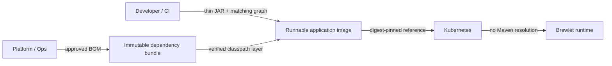

# Managed dependency bundles

Managed dependency bundles let a platform team publish an approved, immutable
Java runtime classpath while application teams keep using normal Maven BOM,
dependency, test, and IDE workflows. Brewlet verifies that an application's
resolved runtime graph matches the approved bundle, rejects fat JARs, and
composes a runnable image from the verified bundle layer and a thin application
JAR.

Kubernetes never resolves Maven dependencies. A `JavaApplication` or raw
Deployment still references only the complete application image.

The [Brewlet specification section 4.5](https://github.com/microsoft/brewlet/blob/main/specs/SPECIFICATION.md#45-managed-dependency-bundles)
is the normative bundle and attestation contract. This page focuses on how to
publish and consume it.



---

## Ownership and lifecycle

| Stage | Owner | Behavior |
|---|---|---|
| BOM policy | Platform / governance | Publish an approved Maven BOM. |
| Bundle publication | Platform / governance | Import the BOM, declare bundle membership, resolve the runtime closure, and publish the immutable dependency bundle. |
| Development | Application team | Import the same BOM and declare dependencies normally. Maven and the IDE continue to resolve dependencies during development. |
| Application publication | Developer / CI | Verify the resolved runtime graph against the bundle lock and publish a thin-JAR image that reuses the exact managed classpath-layer descriptor. |
| Deployment | Platform / Kubernetes | Reference only the immutable final image from `JavaApplication` or a raw workload. |
| Runtime | Brewlet shim | Launch with the dependencies already present under `/app/lib`; no Maven access or startup download occurs. |

Bundle tags are convenient inputs to publication, but deployments should use
the immutable final application image digest. Updating a bundle does not
automatically roll out applications built from an older bundle.

---

## Before you begin

For a Maven workflow, one platform POM can define the approved BOM and publish
its managed dependency bundle. Publish the POM to your Maven repository through
your normal Maven release process; the Brewlet plugin publishes the bundle to
the OCI registry. The application imports the BOM and declares its dependencies
normally. Install the Brewlet Maven plugin as described in
[Building & publishing](building-and-publishing.md#option-c-maven-plugin).

### Example Maven projects

The common setup needs **two POMs**: one owned by the platform team and one
owned by the application team.

=== "1. Platform BOM + bundle"

    The platform POM uses `dependencyManagement` to define the approved versions
    that application projects import and regular `dependencies` to select what
    belongs in the bundle:

    ```xml
    <groupId>com.example.platform</groupId>
    <artifactId>approved-spring-bom</artifactId>
    <version>2026.08</version>
    <packaging>pom</packaging>

    <dependencyManagement>
      <dependencies>
        <dependency>
          <groupId>org.springframework</groupId>
          <artifactId>spring-web</artifactId>
          <version>6.2.10</version>
        </dependency>
      </dependencies>
    </dependencyManagement>

    <dependencies>
      <dependency>
        <groupId>org.springframework</groupId>
        <artifactId>spring-web</artifactId>
      </dependency>
    </dependencies>

    <build>
      <plugins>
        <plugin>
          <groupId>sh.brewlet</groupId>
          <artifactId>brewlet-maven-plugin</artifactId>
          <version>0.5.0</version>
          <configuration>
            <dependencyBundleImage>registry.example.com/platform/java-deps/spring-web:2026.08</dependencyBundleImage>
            <sourceBom>com.example.platform:approved-spring-bom:2026.08</sourceBom>
          </configuration>
        </plugin>
      </plugins>
    </build>
    ```

=== "2. Application"

    The application imports the same BOM and declares dependencies normally.
    Brewlet verifies this resolved runtime graph against the selected bundle:

    ```xml
    <dependencyManagement>
      <dependencies>
        <dependency>
          <groupId>com.example.platform</groupId>
          <artifactId>approved-spring-bom</artifactId>
          <version>2026.08</version>
          <type>pom</type>
          <scope>import</scope>
        </dependency>
      </dependencies>
    </dependencyManagement>

    <dependencies>
      <dependency>
        <groupId>org.springframework</groupId>
        <artifactId>spring-web</artifactId>
      </dependency>
    </dependencies>

    <build>
      <plugins>
        <plugin>
          <groupId>sh.brewlet</groupId>
          <artifactId>brewlet-maven-plugin</artifactId>
          <version>0.5.0</version>
          <configuration>
            <image>registry.example.com/apps/orders:${project.version}</image>
            <dependencyBundle>registry.example.com/platform/java-deps/spring-web:2026.08</dependencyBundle>
            <mainClass>com.example.OrdersApplication</mainClass>
          </configuration>
        </plugin>
      </plugins>
    </build>
    ```

!!! note "When a third POM is useful"

    If your organization already publishes a standalone BOM that should remain
    version-management-only, add a small platform-owned bundle module. That
    optional module imports the existing BOM, declares the bundle dependencies,
    and runs `brewlet:dependency-bundle`. It is an organizational separation,
    not a Brewlet requirement.

---

## Platform workflow: publish a bundle

=== "Maven plugin (recommended)"

    Run this from the platform-owned Maven project that defines the approved
    BOM and declares which dependencies belong in its bundle:

    ```bash
    mvn package brewlet:dependency-bundle \
      -Dbrewlet.dependencyBundleImage=registry.example.com/platform/java-deps/spring-web:2026.08 \
      -Dbrewlet.sourceBom=com.example.platform:approved-spring-bom:2026.08
    ```

    One POM can own both definitions: `dependencyManagement` supplies approved
    versions when the POM is deployed to a Maven repository, while regular
    `dependencies` select the bundle's runtime closure. The
    `brewlet:dependency-bundle` goal publishes only the OCI bundle. If your
    organization keeps its BOM strictly version-only, run the goal from a small
    platform-owned module that imports that BOM and declares the bundle
    dependencies instead.

    The Brewlet Maven plugin selects the bundle contents from the project's
    resolved runtime classpath:

    - regular `<dependencies>` select the direct bundle members;
      `<dependencyManagement>` supplies versions but does not add members;
    - `compile` and `runtime` dependencies and their resolved transitive closure
      are included;
    - `test`, `provided`, and `system` dependencies are excluded, as are
      artifact types Maven does not add to the classpath; and
    - normal Maven conflict mediation, exclusions, and optional-dependency rules
      apply.

    The canonical lock records each dependency's effective scope. An
    application's graph must match that scope exactly, so a `compile`/`runtime`
    difference is rejected even when the artifact bytes are identical. Adjust
    bundle membership with the platform POM's regular dependencies and
    exclusions.

    The goal resolves the runtime dependency closure, creates the canonical
    lock and deterministic flat classpath layer, publishes a CycloneDX 1.5 SBOM,
    and writes a local OCI layout under
    `target/brewlet/dependency-bundle-oci`.

    Optionally sign the bundle provenance with the platform publisher's key and
    identity:

    ```bash
    mvn package brewlet:dependency-bundle \
      -Dbrewlet.dependencyBundleImage=registry.example.com/platform/java-deps/spring-web:2026.08 \
      -Dbrewlet.sourceBom=com.example.platform:approved-spring-bom:2026.08 \
      -Dbrewlet.signingKey=platform-private.pem \
      -Dbrewlet.signerIdentity=https://ci.example.com/platform-bundles
    ```

    Configure `compatibleJdks` in the plugin when the approved classpath is
    restricted to specific JDK feature versions.

=== "Go CLI"

    Supply an already-built flat classpath tar and its canonical lock:

    ```bash
    brewlet dependency-bundle ./deps.tar platform/java-deps/spring-web:2026.08 \
      --store ./oci \
      --name spring-web \
      --version 2026.08 \
      --source-bom com.example.platform:approved-spring-bom:2026.08 \
      --lock ./dependency-lock.json \
      --compatible-jdks 21,25
    ```

    To sign the bundle, add both flags:

    ```bash
    --signing-key platform-private.pem \
    --signer-identity https://ci.example.com/platform-bundles
    ```

!!! warning "Go CLI boundary"

    The Go CLI consumes managed bundles from its `--store` OCI layout and
    requires caller-supplied canonical `--lock` files. Use the Maven plugin for
    BOM import, Maven graph derivation, and direct registry publication or
    consumption.

Every valid bundle includes an SBOM. Bundle provenance is optional: omitting
both signing options publishes an unsigned bundle, while supplying them
publishes a DSSE-signed in-toto bundle-provenance referrer.

---

## Developer workflow: compose an application

Build a genuine thin application JAR. Managed mode rejects nested dependency
JARs, including `BOOT-INF/lib` and `WEB-INF/lib`.

=== "Maven plugin (recommended)"

    ```bash
    mvn package brewlet:push \
      -Dbrewlet.image=registry.example.com/apps/orders:1.4.2 \
      -Dbrewlet.dependencyBundle=registry.example.com/platform/java-deps/spring-web:2026.08 \
      -Dbrewlet.mainClass=com.example.OrdersApplication
    ```

    If the selected bundle has provenance, trust inputs are required:

    ```bash
    -Dbrewlet.trustedPublicKey=platform-public.pem \
    -Dbrewlet.trustedSignerIdentity=https://ci.example.com/platform-bundles
    ```

    Application signing is a separate choice and uses a separate identity:

    ```bash
    -Dbrewlet.signingKey=app-private.pem \
    -Dbrewlet.builderIdentity=https://ci.example.com/application-publisher
    ```

    `brewlet:push` resolves a registry reference directly. It may also consume a
    local dependency-bundle OCI-layout directory.

=== "Go CLI"

    ```bash
    brewlet push ./target/orders.jar apps/orders:1.4.2 \
      --store ./oci \
      --format image \
      --dependency-bundle platform/java-deps/spring-web:2026.08 \
      --dependency-lock ./application-dependency-lock.json \
      --main-class com.example.OrdersApplication
    ```

    For a signed bundle, add:

    ```bash
    --trusted-public-key platform-public.pem \
    --trusted-signer-identity https://ci.example.com/platform-bundles
    ```

    To sign the final application's managed-dependency evidence, add:

    ```bash
    --signing-key app-private.pem \
    --builder-identity https://ci.example.com/application-publisher
    ```

!!! note

    The Go CLI requires the application's caller-supplied canonical
    `--dependency-lock` and resolves the named bundle from the same local
    `--store`. Use the Maven plugin when Brewlet should derive and compare the
    Maven runtime graph or consume the bundle from a registry.

Brewlet compares the complete resolved graph with the bundle lock, including
coordinates, type, classifier, scope, filename, and JAR digest. Managed mode
then forces classpath launch with the application JAR and `lib/*`.

---

## Signed and unsigned combinations

Bundle signing and application signing are independent:

| Bundle | Application | Publication behavior |
|---|---|---|
| Unsigned | Unsigned | Supported when policy permits unsigned evidence. |
| Unsigned | Signed | Final image carries a signed managed-dependency attestation. |
| Signed | Unsigned | Bundle provenance must verify during application publication; final image has no signed attestation. |
| Signed | Signed | Bundle provenance is verified upstream and the final image receives its own application-builder attestation. |

Brewlet determines signing status from the evidence it discovers. A bundle with
no provenance is unsigned. If any provenance is present, Brewlet requires the
trusted key and expected signer identity and validates at least one complete
candidate. Malformed, untrusted, or incorrectly bound provenance fails
verification rather than being treated as unsigned.

The identities represent different roles:

- `signerIdentity` is the platform bundle publisher.
- `builderIdentity` is the application publisher that composed the final image.

Generate a separate ECDSA P-256 key pair for each role you choose to sign:

```bash
brewlet keygen --private platform-private.pem --public platform-public.pem
brewlet keygen --private app-private.pem --public app-public.pem
```

Keep private keys in your CI secret store. Public-key distribution and rotation
are platform responsibilities.

Production admission verifies the final-image application-builder attestation.
Bundle-publisher trust is enforced earlier, while composing the image. See
[Admission enforcement](admission-enforcement.md#image-level-and-bundle-level-trust).

---

## What the final image records

The complete kubelet-pullable image:

- reuses the exact verified managed classpath-layer descriptor, preserving its
  digest, size, annotations, and uncompressed diff ID;
- contains the thin application JAR and launches it with the managed
  dependencies under `/app/lib`;
- records canonical managed-dependency evidence binding the application JAR,
  bundle, dependency layer, lock, SBOM, source BOM, and thin-JAR verdict; and
- when application signing is enabled, carries a DSSE/in-toto
  managed-dependency attestation bound to the immutable final image digest and
  application-builder identity.

The layer is the same standard OCI gzip layer used by the runnable image, so
registries and containerd can deduplicate it without repacking. See
[Layered classpath deployment](layered-classpath-deployment.md) for the runtime
layout and cache behavior.

---

## Failure behavior

Managed publication fails closed. It does not silently rebuild dependency
layers from the application project after an error.

Failures include:

- bundle resolution errors or wrong artifact/config/layer/lock media types and
  schemas;
- descriptor digest or size mismatches;
- invalid USTAR headers/checksums, truncated blocks or file data, nonzero file
  padding, missing end markers, or data appended after the archive terminator;
- unsafe tar entries, invalid UTF-8 entry names, unexpected files, or individual
  JAR digest mismatches;
- missing, duplicate, or invalid SBOM evidence;
- graph differences in coordinates, type, classifier, scope, filename, or
  content digest;
- nested or fat application JARs;
- an application JDK outside the bundle's compatible-JDK policy; and
- malformed, untrusted, wrong-identity, wrong-subject, or incorrectly bound
  provenance when provenance is present.

A matching layer digest does not make malformed tar framing valid. Both Go and
Maven validate the archive structure independently of the layer and per-JAR
SHA-256 checks. Published layers use flat regular-file USTAR records, zero
padding to 512-byte boundaries, and two zero end blocks; extra complete zero
blocks are allowed. Valid permission, owner, and timestamp values need not equal
the canonical publisher defaults. Header checksums are format checks, not a
replacement for cryptographic digests or signer verification.

Regenerate a malformed bundle with the approved producer rather than bypassing
validation or silently reconstructing dependencies from a different graph.

Use `brewlet inspect` to inspect a local bundle or final image and optionally
verify its attestation with the configured trusted key and identity. Enforce
signed final images before they run by deploying
[Admission enforcement](admission-enforcement.md).
