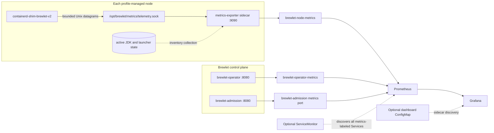

# Runtime metrics and Grafana dashboards

Brewlet can expose Prometheus telemetry for the control plane, runtime launch
path, and node-installed JDK and launcher inventory. This telemetry complements
application metrics such as Micrometer, JMX, and OpenTelemetry; it describes
what Brewlet itself is doing.

Runtime metrics are **disabled by default**. Existing installations and upgrades
do not expose these endpoints unless an operator explicitly sets
`metrics.enabled=true`.

---

## Enable metrics

Enable the three Prometheus scrape surfaces with:

```yaml
metrics:
  enabled: true
```

To also create a Prometheus Operator `ServiceMonitor` and a Grafana
sidecar-discoverable dashboard ConfigMap:

```yaml
metrics:
  enabled: true
  nodePort: 9090
  serviceMonitor:
    enabled: true
    interval: 30s
    additionalLabels: {}
  grafanaDashboard:
    enabled: true
    labels:
      grafana_dashboard: "1"
```

Install or upgrade Brewlet with the values file:

```bash
helm upgrade --install brewlet oci://ghcr.io/microsoft/charts/brewlet \
  --version 0.3.1 \
  --values metrics-values.yaml
```

!!! important
    `metrics.serviceMonitor.enabled=true` requires the
    `monitoring.coreos.com/v1` CRDs provided by Prometheus Operator. The chart
    does not install Prometheus Operator.

!!! note
    `metrics.grafanaDashboard.enabled=true` creates the
    `brewlet-grafana-dashboard` ConfigMap. It does not install Grafana, a
    dashboard sidecar, or a Prometheus data source.

`metrics.nodePort` controls the port exposed by the node-local exporter and its
headless Service. It defaults to `9090`. The operator and admission webhook use
port `8080`.

---

## Telemetry architecture



The Runtime v2 shim sends versioned, bounded-cardinality events as Unix
datagrams to `/opt/brewlet/metrics/telemetry.sock`. Sending is best-effort, with
a short write deadline. The shim's callers ignore telemetry failures:
observability must never block or fail workload launch.

The `metrics-exporter` sidecar runs in every profile-managed provisioner
DaemonSet. It receives shim events, exposes them as Prometheus counters and
histograms, and derives inventory gauges from the node's active JDK and launcher
state under `/opt/brewlet`.

The operator and admission webhook use controller-runtime's Prometheus registry.
Their endpoints include standard controller-runtime/process metrics alongside
the Brewlet-specific collectors described below.

---

## Scrape surfaces

| Surface | Default port | Scope | Notable telemetry |
|---|---:|---|---|
| `brewlet-operator-metrics` | 8080 | Control plane | NodeProfile assigned/ready state, readiness conditions, provisioning transitions, controller-runtime metrics |
| `brewlet-admission` port `metrics` | 8080 | Control plane | Admitted, denied, errored, and fail-open admission outcomes |
| `brewlet-node-metrics` | 9090 | Each provisioned node | Launch phases/outcomes, artifact resolution, AppCDS decisions, invalid telemetry, JDK and launcher inventory |

`brewlet-node-metrics` is headless so Prometheus can scrape each exporter pod
instead of aggregating behind one virtual IP.

### Verify the Services

```bash
kubectl get service -n brewlet \
  brewlet-operator-metrics \
  brewlet-admission \
  brewlet-node-metrics

kubectl get service brewlet-admission -n brewlet \
  -o jsonpath='{.spec.ports[?(@.name=="metrics")].port}{"\n"}'
```

### Scrape the operator

```bash
kubectl port-forward -n brewlet service/brewlet-operator-metrics 18080:8080
```

In another terminal:

```bash
curl --fail http://127.0.0.1:18080/metrics
```

### Scrape the admission webhook

```bash
kubectl port-forward -n brewlet service/brewlet-admission 18081:8080
```

In another terminal:

```bash
curl --fail http://127.0.0.1:18081/metrics
```

### Scrape one node exporter

Find a profile-managed provisioner pod:

```bash
kubectl get pods -n brewlet -l app=brewlet-node-provisioner -o wide
```

Then forward its exporter port:

```bash
kubectl port-forward -n brewlet pod/<provisioner-pod> 19090:9090
```

In another terminal:

```bash
curl --fail http://127.0.0.1:19090/metrics
```

If you changed `metrics.nodePort`, replace `9090` with that value.

---

## Metric catalog

### Runtime and node metrics

| Metric | Type | Labels | Interpretation |
|---|---|---|---|
| `brewlet_sandbox_launch_duration_seconds` | Histogram | `phase`, `outcome` | Time spent in bounded launch phases: `artifact_resolve`, `bundle_prepare`, `overlay_setup`, `runc_create`, and `process_start`; outcome is `success` or `error`. |
| `brewlet_sandbox_launches_total` | Counter | `outcome`, `reason`, `entry_mode`, `artifact_format` | Completed launch results. Entry mode is `jar`, `classpath`, `module`, or `unknown`; format is `native`, `image`, or `unknown`. Failure reasons use a fixed vocabulary rather than raw error text. |
| `brewlet_artifact_resolution_duration_seconds` | Histogram | `backend`, `artifact_format`, `outcome` | Time spent resolving content already available to the shim. Backend is `layout` or `containerd`; this is **not** registry pull or cache timing. |
| `brewlet_cds_regeneration_decisions_total` | Counter | `role` | AppCDS decisions: `consume`, `write`, `defer`, or `skip`. |
| `brewlet_telemetry_events_invalid_total` | Counter | None | Malformed, unknown-version, or unsupported shim datagrams rejected by the exporter. |
| `brewlet_jdk_info` | Gauge | `distribution`, `feature`, `version`, `vendor`, `arch`, `source` | Value `1` identifies each active JDK build on a node. |
| `brewlet_jdk_installed_timestamp_seconds` | Gauge | `distribution`, `feature`, `version` | Unix timestamp when that JDK root was installed on the node. It is **not** the upstream JDK patch release date. |
| `brewlet_launcher_info` | Gauge | `launcher` | Value `1` identifies an available launcher. Vanilla `java` is always emitted; additional installed launchers such as `jaz` are also reported. |

`brewlet_sandbox_launches_total` uses these bounded failure reasons:
`NoCompatibleJDK`, `NoCompatibleLauncher`, `NoCompatibleArch`,
`MissingArtifactReference`, `ArtifactResolution`, `OverlaySetup`,
`RuntimeCreate`, `ProcessStart`, and `BundlePreparation`. Successful launches use
`reason="none"`.

### Control-plane metrics

| Metric | Type | Labels | Interpretation |
|---|---|---|---|
| `brewlet_admission_requests_total` | Counter | `outcome`, `reason` | Brewlet pod admission outcomes: `admitted`, `denied`, `error`, or `fail_open`. Reasons are bounded decision/error categories such as `none`, `decode`, `encode`, `fleet_unavailable`, or a compatibility denial reason. Non-Brewlet pods are not counted. |
| `brewlet_nodeprofile_nodes` | Gauge | `profile`, `state` | Current node counts for each profile, with `state="assigned"` or `state="ready"`. |
| `brewlet_nodeprofile_condition` | Gauge | `profile`, `reason`, `status` | Current NodeProfile readiness condition. The active condition series has value `1`; previous reason series for that profile are removed. |
| `brewlet_node_provision_transitions_total` | Counter | `state` | Node provisioning state transitions grouped by bounded state. |

---

## PromQL examples

### Launch latency

p95 launch latency by phase:

```promql
histogram_quantile(
  0.95,
  sum by (le, phase) (
    rate(brewlet_sandbox_launch_duration_seconds_bucket[5m])
  )
)
```

Average launch phase duration:

```promql
sum by (phase) (
  rate(brewlet_sandbox_launch_duration_seconds_sum[5m])
)
/
sum by (phase) (
  rate(brewlet_sandbox_launch_duration_seconds_count[5m])
)
```

### Launches and artifact resolution

Launch outcome rate:

```promql
sum by (outcome, reason) (
  rate(brewlet_sandbox_launches_total[5m])
)
```

Artifact resolution p95 by backend:

```promql
histogram_quantile(
  0.95,
  sum by (le, backend) (
    rate(brewlet_artifact_resolution_duration_seconds_bucket[5m])
  )
)
```

### Admission and provisioning

Admission denials:

```promql
sum by (reason) (
  rate(brewlet_admission_requests_total{outcome="denied"}[5m])
)
```

Admission errors and fail-open decisions:

```promql
sum by (outcome, reason) (
  rate(
    brewlet_admission_requests_total{
      outcome=~"error|fail_open"
    }[5m]
  )
)
```

NodeProfile assigned and ready counts:

```promql
brewlet_nodeprofile_nodes
```

Nodes assigned but not ready:

```promql
brewlet_nodeprofile_nodes{state="assigned"}
-
on (profile)
brewlet_nodeprofile_nodes{state="ready"}
```

Provisioning transitions:

```promql
sum by (state) (
  rate(brewlet_node_provision_transitions_total[5m])
)
```

### AppCDS and inventory

AppCDS decisions:

```promql
sum by (role) (
  rate(brewlet_cds_regeneration_decisions_total[5m])
)
```

Installed JDK inventory:

```promql
brewlet_jdk_info
```

Available launchers:

```promql
brewlet_launcher_info
```

Malformed telemetry observed recently:

```promql
increase(brewlet_telemetry_events_invalid_total[15m])
```

Use `rate()` or `increase()` for counters and histogram series when you want
activity over a time window. Query inventory and current-state gauges directly
as instant vectors; applying `rate()` to `brewlet_jdk_info`,
`brewlet_launcher_info`, or `brewlet_nodeprofile_nodes` does not describe their
intended meaning.

---

## Prometheus Operator integration

When `metrics.serviceMonitor.enabled=true`, Helm creates one `ServiceMonitor`
named `brewlet`. It selects Services in the Brewlet namespace with:

```yaml
brewlet.sh/metrics: "true"
```

All three scrape surfaces expose a port named `metrics`, so the same endpoint
configuration covers the operator, admission webhook, and node exporters.

Prometheus installations commonly require labels on a `ServiceMonitor` before
they select it. Put those labels in:

```yaml
metrics:
  serviceMonitor:
    enabled: true
    additionalLabels:
      release: prometheus
```

The required labels depend on your Prometheus Operator deployment. Check the
Prometheus resource's `serviceMonitorSelector` rather than assuming a label
name.

---

## Bundled Grafana dashboard

When `metrics.grafanaDashboard.enabled=true`, Helm creates a ConfigMap named
`brewlet-grafana-dashboard` containing the **Brewlet runtime** dashboard. Its
labels are configurable so a Grafana dashboard sidecar can discover it.

The bundled dashboard includes:

- sandbox launch p95 latency by phase;
- sandbox launch outcomes;
- admission denials;
- NodeProfile readiness;
- AppCDS decisions;
- installed JDK inventory.


*The bundled Brewlet runtime dashboard populated by live integration-test
telemetry.*


*Brewlet metrics inspected directly in Grafana Explore.*

These captures used Grafana 12.1.0 backed by Prometheus 3.5.0. They document the
tested setup, not minimum supported versions.

If the dashboard appears but panels have no data, verify that Grafana has a
working Prometheus data source and that it points at the Prometheus instance
scraping Brewlet.

---

## Operational signals

The right thresholds depend on workload volume, cluster size, and your normal
provisioning behavior. Start by graphing these signals and establish a baseline
before attaching alerts:

- non-zero increases in `brewlet_telemetry_events_invalid_total`;
- the failed launch ratio and its bounded failure reasons;
- sustained admission `error` or `fail_open` outcomes;
- NodeProfiles with assigned nodes that do not become ready;
- unexpected or repeatedly changing provisioning states;
- missing JDK or launcher inventory after a profile reports ready;
- changes in AppCDS decisions after JDK installation or patching.

### Cardinality and privacy

Brewlet's telemetry contract intentionally uses bounded labels. It excludes pod
names, artifact references, digests, arbitrary error text, and other
workload-specific identifiers. This both controls Prometheus cardinality and
avoids leaking workload identity through the metrics surface.

Aggregate the provided labels instead of relabeling in pod names, image
references, digests, or unbounded error messages. Use Kubernetes events and
component logs when you need to investigate an individual workload.

---

## Troubleshooting

### Metrics Services are absent

Confirm that the installed release has metrics enabled:

```bash
helm get values brewlet --all
kubectl get service -n brewlet
```

With metrics disabled, the chart does not create
`brewlet-operator-metrics` or `brewlet-node-metrics`, does not add the admission
metrics port, and configures the operator and admission metrics bind address as
`0`.

### The node target is absent

Check the profile-managed DaemonSet and its exporter sidecar:

```bash
kubectl get daemonset -n brewlet
kubectl get daemonset <profile-daemonset> -n brewlet \
  -o jsonpath='{range .spec.template.spec.containers[*]}{.name}{"\t"}{.command}{"\n"}{end}'
```

The second container should be named `metrics-exporter` and run:

```text
/opt/brewlet-dist/brewlet-metrics-exporter
```

Then check that the DaemonSet has ready pods on the expected nodes:

```bash
kubectl get pods -n brewlet -l app=brewlet-node-provisioner -o wide
```

### Runtime counters remain empty

The socket is node-local and is created by the exporter:

```text
/opt/brewlet/metrics/telemetry.sock
```

Verify it from the exporter container:

```bash
kubectl exec -n brewlet <provisioner-pod> -c metrics-exporter -- \
  test -S /opt/brewlet/metrics/telemetry.sock
```

Inspect the exporter sidecar logs:

```bash
kubectl logs -n brewlet <provisioner-pod> -c metrics-exporter
```

No launch samples are expected until Brewlet workloads run on that node.
Telemetry delivery is best-effort, so workload success does not guarantee that
every event was observed.

### Inventory is empty

JDK inventory is based on the node's active Brewlet state. Confirm that the
NodeProfile is ready and that the provisioner completed:

```bash
kubectl get nodeprofile
kubectl describe nodeprofile <profile>
kubectl get nodes -L brewlet.sh/runtime
```

An unready profile or a node with no active JDK state can legitimately expose no
`brewlet_jdk_info` series.

### Prometheus does not discover the targets

Check the ServiceMonitor, its selector, and Prometheus target status:

```bash
kubectl get servicemonitor brewlet -n brewlet -o yaml
kubectl get service -n brewlet -l brewlet.sh/metrics=true --show-labels
```

Verify:

- the Prometheus Operator CRDs exist;
- the `ServiceMonitor` has any labels required by the Prometheus
  `serviceMonitorSelector`;
- Prometheus watches the Brewlet namespace;
- each selected Service exposes a port named `metrics`;
- NetworkPolicies permit Prometheus to reach the endpoints.

### Grafana does not load the dashboard

Inspect the ConfigMap and compare its labels with the dashboard sidecar
configuration:

```bash
kubectl get configmap brewlet-grafana-dashboard -n brewlet --show-labels
```

The default discovery label is `grafana_dashboard: "1"`, but your sidecar may
expect a different key or value. Also confirm that Grafana has a Prometheus data
source; the ConfigMap supplies only dashboard JSON.

---

## Implementation validation

The Brewlet monorepo's
[`integration-tests/e2e/tier15-metrics-incluster.sh`](https://github.com/microsoft/brewlet/blob/main/integration-tests/e2e/tier15-metrics-incluster.sh)
exercises the live operator -> provisioner -> shim -> exporter path, all three
scrape surfaces, inventory collectors, and runtime events. It is implementation
validation for contributors, not an end-user installation procedure.

## Next steps

- **[Observability & day-2 operations](observability.md)** - application-level
  observability and general fleet operations.
- **[Configuration](configuration.md)** - the complete Helm and component
  configuration reference.
- **[Troubleshooting](troubleshooting.md)** - broader installation and runtime
  failure modes.
